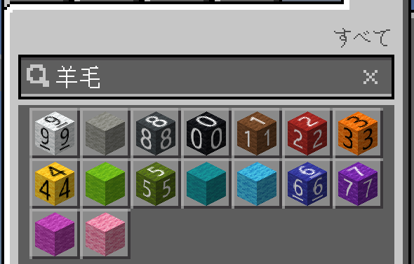

# Minecraft Numeric Blocks Add-on

Minecraftで数字ブロック（色付き羊毛）を一列に配置するアドオンです。抵抗器のカラーコードに基づいた色分けで数字0-9を表現します。

## 📥 ダウンロード

[最新リリース](../../releases/latest)から`Numeric_Blocks.mcaddon`をダウンロードしてください。

## ✨ 機能

- カスタムスクリプトコマンドで数字ブロックを自動配置
- 抵抗器カラーコード方式（0=黒、1=茶、2=赤、3=橙、4=黄、5=緑、6=青、7=紫、8=灰、9=白）
- ランダムな数字列を生成
- 6方向（上下東西南北）に配置可能
- 3つのディメンション（オーバーワールド、ネザー、エンド）に対応

## 🎮 使い方

### インストール

1. [Releases](../../releases)から最新の`Numeric_Blocks.mcaddon`をダウンロード
2. ダウンロードしたファイルをダブルクリックしてMinecraftにインポート
3. ワールド設定で以下を有効化:
   - ビヘイビアパック: Numeric Blocks
   - リソースパック: Numeric Blocks

### コマンド

```
/scriptevent mming:numline <x> <y> <z> <direction> <length> [dimension]
```

#### パラメータ

- `x`, `y`, `z`: 開始座標（整数）
- `direction`: 配置方向
  - `0` = 下（Y-）
  - `1` = 上（Y+）
  - `2` = 北（Z-）
  - `3` = 南（Z+）
  - `4` = 西（X-）
  - `5` = 東（X+）
- `length`: ブロック数（1～10）
- `dimension`: （オプション）ディメンション
  - `overworld` = オーバーワールド
  - `nether` = ネザー
  - `the_end` = ジ・エンド
  - 省略時はプレイヤーの現在のディメンション

#### 使用例

```
# 座標(10, 64, 10)から東に5ブロック配置
/scriptevent mming:numline 10 64 10 5 5

# 座標(0, 100, 0)から上に10ブロック配置（ネザー）
/scriptevent mming:numline 0 100 0 1 10 nether

# プレイヤーの足元から北に3ブロック配置
/scriptevent mming:numline ~ ~ ~ 2 3
```

## 🎨 数字とブロックの対応



抵抗器カラーコード方式に基づいた色分け：

| 数字 | 色 | ブロック |
|------|------|----------|
| 0 | 黒 | 黒色の羊毛 |
| 1 | 茶 | 茶色の羊毛 |
| 2 | 赤 | 赤色の羊毛 |
| 3 | 橙 | 橙色の羊毛 |
| 4 | 黄 | 黄色の羊毛 |
| 5 | 緑 | 緑色の羊毛 |
| 6 | 青 | 青色の羊毛 |
| 7 | 紫 | 紫色の羊毛 |
| 8 | 灰 | 灰色の羊毛 |
| 9 | 白 | 白色の羊毛 |

## 🔧 対応バージョン

- Minecraft Bedrock Edition 1.21.0以上
- Minecraft Education Edition

## 👨‍💻 開発者向け

### 必要なもの

- Node.js (v16以上推奨)
- npm

### セットアップ

```bash
# リポジトリのクローン
git clone https://github.com/Mming-Lab/minecraft-numeric-blocks-mcaddon.git
cd minecraft-numeric-blocks-mcaddon

# 依存関係のインストール
npm install

# .envファイルの作成（.env.exampleをコピー）
cp .env.example .env

# .envファイルを編集してCUSTOM_DEPLOYMENT_PATHを設定
```

### ビルドコマンド

```bash
# 開発ビルド
npm run build

# リント
npm run lint

# 配布用.mcaddonの作成
npm run mcaddon

# 自動リビルド＆デプロイ（開発時）
npm run local-deploy

# クリーンアップ
npm run clean
```

### プロジェクト構造

```
minecraft-numeric-blocks-mcaddon/
├── scripts/main.ts              # メインスクリプト
├── behavior_packs/              # ビヘイビアパック
├── resource_packs/              # リソースパック
├── .github/workflows/           # GitHub Actions設定
├── package.json                 # npm設定
├── tsconfig.json                # TypeScript設定
├── just.config.ts               # ビルドタスク設定
└── .env.example                 # 環境設定テンプレート
```

## 📄 ライセンス

このプロジェクトはMITライセンスの下で公開されています。

## 👤 作者

mming -ミング-

## 🐛 バグ報告・機能要望

[Issues](../../issues)でバグ報告や機能要望を受け付けています。
