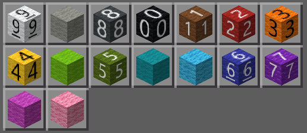

# 数字ブロックアドオン

色付き羊毛を使って数字0-9を表現するMinecraftアドオンです。抵抗器のカラーコード方式で色分けされた羊毛ブロックは、教育的な活動やゲームの謎解きなど、様々な場面で活用できます。

## 📥 ダウンロード

[最新リリース](../../releases/latest)から`Numeric_Blocks.mcaddon`をダウンロードしてください。

## ✨ 数字ブロック機能

このアドオンは、抵抗器カラーコード方式に基づいた色付き羊毛ブロックで数字0-9を表現します：

- **0＝黒色** / **1＝茶色** / **2＝赤色** / **3＝橙色** / **4＝黄色**
- **5＝緑色** / **6＝青色** / **7＝紫色** / **8＝灰色** / **9＝白色**

各ブロックはテクスチャで数字が表示されるため、ゲーム内で数字を視覚的に認識できます。

## 🎮 インストール方法

1. [Releases](../../releases)から最新の`Numeric_Blocks.mcaddon`をダウンロード
2. ダウンロードしたファイルをダブルクリックしてMinecraftにインポート
3. ワールド設定でビヘイビアパックまたはリソースパック「Numeric Blocks」を有効化

これで、数字ブロック（色付き羊毛）がゲーム内で使用可能になります。

## 🎨 ブロック一覧

各数字は対応する色の羊毛ブロックで表現されます。抵抗器カラーコードと同じ配色です。

| 数字 | 色 | 語呂合わせ |
|------|------|----------|
| 0 | 黒 | 黒い礼服 |
| 1 | 茶 | お茶を一杯 |
| 2 | 赤 | 赤い人参 |
| 3 | 橙 | 第三の男 |
| 4 | 黄 | 岸恵子 / 四季 |
| 5 | 緑 | 五月緑 |
| 6 | 青 | 青二才の六でなし |
| 7 | 紫 | 紫式部 |
| 8 | 灰 | ハイヤー |
| 9 | 白 | ホワイトクリスマス |

